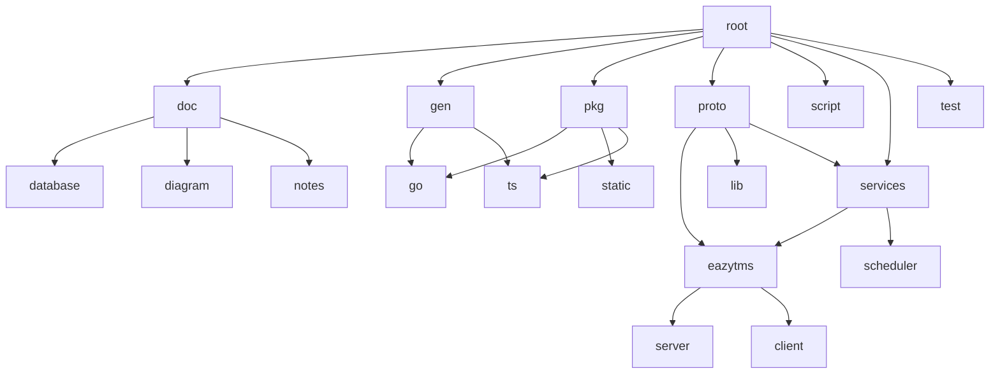

# Project Skeleton for Web Apps

## Table of Contents

1. [Getting Started](#getting-started)
2. [Project Structure](#project-structure)
3. [Setup](#setup)
4. [Running the Application](#running-the-application)

## Getting Started

To get started, clone the repository and follow the setup instructions below.

```bash
git clone git@github.com:StefanTrsunov/skeleton.git
```

## Project Structure

## Setup

* Build the UI server

```bash
npm run build
```

## Running the Application

* Run the API server

```bash
go run main.go
```

* Start the development server:

```bash
npm run start
```

